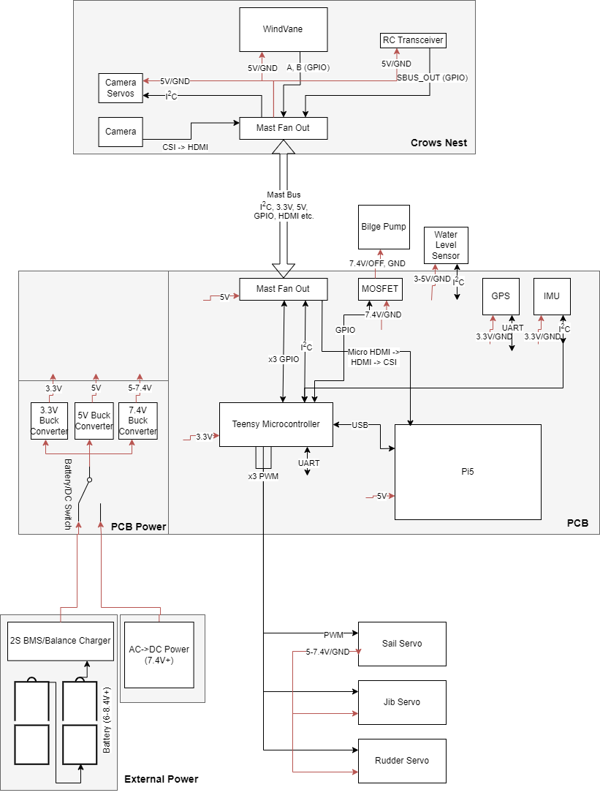

This is an overview of the main electronics we have on the boat and how they are connected to each other.

> Note: Some things are subject to change and may not be immediately updated in the diagram. Additionally, many lower level components and software protocols are obscured for clarity.

### Wire Color Guide
Guideline for what color our wires mean. This is not absolute. Always check the wire ends/schematic and test with a multimeter. Some things like using red for voltage and black for ground should *ALWAYS* be followed whereas SDA/SCL are more flexible.

| Color | Meaning |
| ----- | ------- |
| **RED** | Power (VCC) |
| **BLACK** | GROUND |
| **YELLOW** | PWM/GPIO |
| **WHITE** | PWM/GPIO |
| **GREEN** | SDA/GPIO | 
| **PURPLE****/****BLUE** | SCL/GPIO |